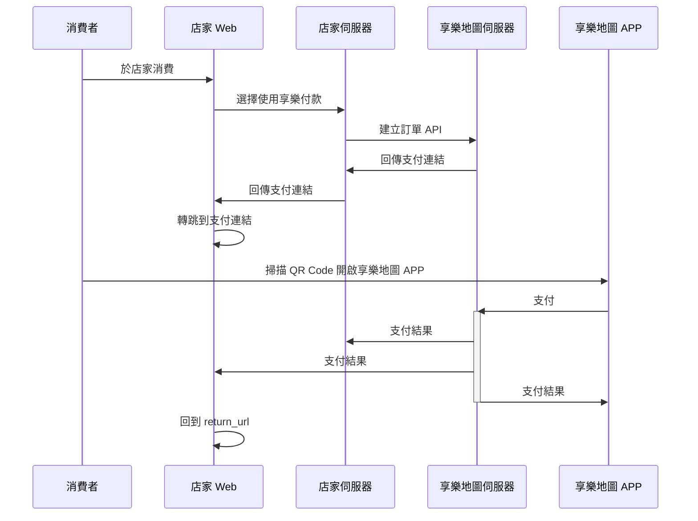
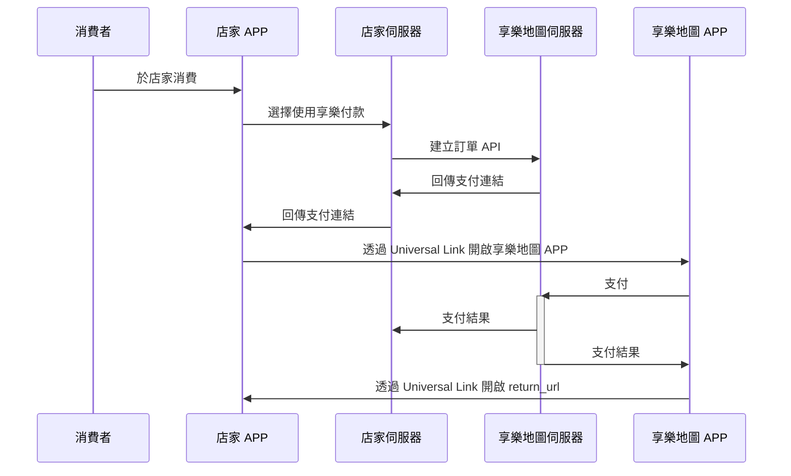

# 享樂支付串接

## 流程

### Web



<div style="page-break-after: always;"></div>

### Mobile APP



<div style="page-break-after: always;"></div>

## APIs

### 建立支付

#### 請求網址

|      | Methods | URL                                        |
|------|---------|--------------------------------------------|
| 測試環境 | POST    | `https://api-test.joymap.tw/pay/v1/create` |
| 正式環境 | POST    | `https://api.joymap.tw/pay/v1/create`      |

#### 請求參數

| 參數名稱        | 說明       | 必填  | 型態          | 備註                                                      |
|-------------|----------|:---:|-------------|---------------------------------------------------------|
| merchant_id | 店家代號     |  Ｏ  | String(20)  | 由享樂地圖提供                                                 |
| order_no    | 自訂編號     |  Ｏ  | String(25)  | 店家自訂編號，限英文及數字，長度限制為 25 個字元，編號不可重覆                       |
| timestamp   | 現在時間戳記   |  Ｏ  | Integer     | 現在時間戳記，容許誤差±30秒，享樂地圖伺服器使用 UTC+08:00 時區                  |
| comment     | 備註       |  Ｏ  | String(100) | 店家自訂備註                                                  |
| amount      | 金額       |  Ｏ  | Integer(5)  | 新台幣整數                                                   |
| return_url  | 支付結果返回網址 |  Ｏ  | String(500) | 會將結果以 GET 方式轉跳到這個網址，與 notify_url 相同參數，實際支付只有一次，請自行做好判斷  |
| notify_url  | 支付結果通知網址 |  Ｏ  | String(500) | 會將結果以 POST 方式請求到這個網址，與 return_url 相同參數，實際支付只有一次，請自行做好判斷 |
| check_code  | 檢查碼      |  Ｏ  | String(64)  | 詳見 ++[檢查碼](#檢查碼)++                                      |


<div style="page-break-after: always;"></div>

#### 回傳參數

| 參數名稱                      | 說明         | 型態      | 備註                                                                         |
|---------------------------|------------|---------|----------------------------------------------------------------------------|
| code                      | 結果代碼       | Integer | 狀態碼，非 1 皆為失敗                                                               |
| msg                       | 結果訊息       | String  | 訊息                                                                         |
| return                    |            | Array   | 回傳資料                                                                       |
| return.reserve_no         | 預約支付單號     | String  | 享樂地圖預約支付單號                                                                 |
| return.qrcode_text        | QR Code 文字 | String  | 可自行產生 QR Code 提供享樂地圖 APP 掃描                                                |
| return.web_url            | 網頁網址       | String  | 用來跳轉到付款頁的 Web URL<br>在網頁請求付款時使用，直接跳轉到即可                                    |
| return.universal_link_url | 資料         | String  | 用來跳轉到付款頁的 Universal Link URL<br>在 APP 請求付款時使用，請使用 Universal Link Mode 開啟連結 |

<div style="page-break-after: always;"></div>

#### 支付結果請求參數

| 參數名稱         | 說明       | 型態         | 備註                                                         |
|--------------|----------|------------|------------------------------------------------------------|
| status       | 支付狀態     | String     | -1=支付失敗<br>0=等待支付中<br>1=支付成功<br>2=支付過期<br>3=部分退款<br>4=全額退款 |
| reserve_no   | 預約支付單號   | String     | 享樂地圖預約支付單號                                                 |
| order_no     | 店家自訂編號   | String     | 店家自訂編號                                                     |
| amount       | 支付金額     | String     | 支付金額                                                       |
| card_amount  | 刷卡金額     | String     | 刷卡金額                                                       |
| jcoin_amount | 折抵金額     | String     | 享樂幣折抵金額                                                    |
| card_4_num   | 信用卡末四碼   | String     | 可能為 NULL，如有信用卡支付產生，會提供                                     |
| created_at   | 預約支付建立時間 | String     | 格式: Y-m-d H:i:s                                            |
| pay_at       | 支付時間     | String     | 可能為 NULL，如使用者有支付動作此欄位才有值，格式: Y-m-d H:i:s                   |
| expired_at   | 支付過期時間   | String     | 格式: Y-m-d H:i:s                                            |
| timestamp    | 現在時間戳記   | String     | 現在時間戳記，享樂地圖伺服器使用 UTC+08:00 時區                              |
| check_code   | 檢查碼      | String(64) | 詳見 ++[檢查碼](#檢查碼)++                                         |

<div style="page-break-after: always;"></div>

### 查詢

#### 請求網址

|      | Methods | URL                                       |
|------|---------|-------------------------------------------|
| 測試環境 | POST    | `https://api-test.joymap.tw/pay/v1/query` |
| 正式環境 | POST    | `https://api.joymap.tw/pay/v1/query`      |

#### 請求參數

| 參數名稱        | 說明     | 必填  | 型態         | 備註                                     |
|-------------|--------|:---:|------------|----------------------------------------|
| merchant_id | 店家代號   |  Ｏ  | String(20) | 由享樂地圖提供                                |
| query_type  | 查詢方式   |  Ｏ  | Integer(1) | 1 或 2<br>1: 店家自訂編號查詢<br>2: 預約支付單號查詢    |
| order_no    | 查詢編號   |  Ｏ  | String(25) |                                        |
| timestamp   | 現在時間戳記 |  Ｏ  | Integer    | 現在時間戳記，容許誤差±30秒，享樂地圖伺服器使用 UTC+08:00 時區 |
| check_code  | 檢查碼    |  Ｏ  | String(64) | 詳見 ++[檢查碼](#檢查碼)++                     |

<div style="page-break-after: always;"></div>

#### 回傳參數

| 參數名稱              | 說明       | 型態         | 備註                                                         |
|-------------------|----------|------------|------------------------------------------------------------|
| code              | 結果代碼     | Integer    | 狀態碼，非 1 皆為失敗                                               |
| msg               | 結果訊息     | String     | 訊息                                                         |
| return            |          | Array      | 回傳資料                                                       |
| return.status     | 支付狀態     | String     | -1=支付失敗<br>0=等待支付中<br>1=支付成功<br>2=支付過期<br>3=部分退款<br>4=全額退款 |
| return.reserve_no | 預約支付單號   | String     | 享樂地圖預約支付單號                                                 |
| return.order_no   | 店家自訂編號   | String     | 店家自訂編號                                                     |
| return.amount     | 金額       | String     | 支付金額                                                       |
| return.card_4_num | 信用卡末四碼   | String     | 可能為 NULL，如有信用卡支付才有值                                        |
| return.created_at | 預約支付建立時間 | String     | 格式: Y-m-d H:i:s                                            |
| return.pay_at     | 支付時間     | String     | 可能為 NULL，如使用者有支付動作才有值<br>格式: Y-m-d H:i:s                   |
| return.expired_at | 支付過期時間   | String     | 格式: Y-m-d H:i:s                                            |
| return.timestamp  | 現在時間戳記   | String     | 現在時間戳記，享樂地圖伺服器使用 UTC+8 時區                                  |
| return.check_code | 檢查碼      | String(64) | 詳見 ++[檢查碼](#檢查碼)++                                         |

<div style="page-break-after: always;"></div>

### 退款

#### 請求網址

|      | Methods | URL                                        |
|------|---------|--------------------------------------------|
| 測試環境 | POST    | `https://api-test.joymap.tw/pay/v1/refund` |
| 正式環境 | POST    | `https://api.joymap.tw/pay/v1/refund`      |

#### 請求參數

TODO

#### 回傳參數

TODO

<div style="page-break-after: always;"></div>

## 檢查碼

### 規則

配合店家每次發動 API 時必須帶入檢查碼以防偽造請求。
享樂地圖會提供一組 `hashPrefix`，請勿外洩此字串，依照以下步驟產生檢查碼。

1. 將帶入參數 hashPrefix、merchant_id、order_no、timestamp 串連成一個字串 A。
2. 將字串 A 使用 SHA256 方式進行雜湊，產生一組 64 碼的字串 B。
3. 將字串 B 轉為小寫。

### 範例
```
hashPrefix = '052cbac5-a51d-48bd-9de9-bade16d25df7'
merchant_id = 'JMP00000000'
order_no = 'JP0000001'
timestamp = 1704038400

A = 052cbac5-a51d-48bd-9de9-bade16d25df7JMP00000000JP00000011704038400

B = sha256(A)

check_code = b61d887098a8ac93f8f7d071ddc99bc55cf52aff0e0abcbdb5bc56562fc07133
```

### PHP 範例程式

```php
function getCheckCode(string $hashPrefix, array $request): string
{
    $a = $hashPrefix . 
        $request['merchant_id'] . 
        $request['order_no'] . 
        $request['timestamp'];
        
    $b = hash('sha256', $a);
    
    return strtolower($b);
}
```

<div style="page-break-after: always;"></div>

## 回應範例

| HTTP 狀態碼 |   code | 錯誤原因         |
|---------:|-------:|--------------|
|      200 |      1 | 成功           |
|      400 | 400101 | 店家支付功能已停用    |
|      400 | 400102 | 店家尚未開通支付功能   |
|      422 | 400103 | order_no 已重複 |
|      422 | 400104 | 查無此支付        |
|      422 |    422 | 參數有誤         |
|      429 |    429 | 重複請求、請求過於頻繁  |
|      500 |      0 | 伺服器例外錯誤      |
